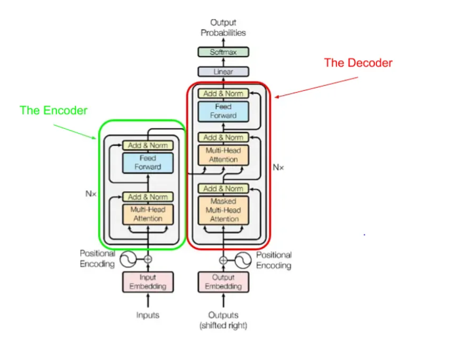

### Transformers

Transformers are neural network models which is a combination of serveral blocks some of them are encoders and decoders whose main task is essentially to produce next words.
The training is done in a semi supervised way, ie it is trained on an unsupervised dataset and then finetuned with labelled data
It works on attention mechanism that is it calculates how much attention to give a particular word of a sentence and then predict the next word depending on the weights assigned to each word in a sentence

175B parameters
Backpropagation
attention
12K+ dimensions in gpt3

context size 2048 

differnce between man and woman is same as difference between king and queen  - embeddings

temperature

Dot product

#### Process
- Tokenization
Break a bigger sentence in tokens

- WordEmbeddings
- Unembeddings

